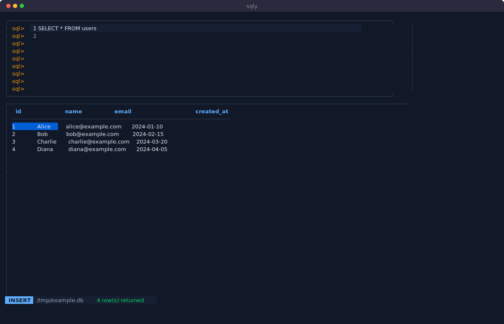

# sqly

A terminal UI SQL client built with [Bubble Tea](https://github.com/charmbracelet/bubbletea). Currently supports SQLite, with MySQL/PostgreSQL planned.

## Screenshot



## Installation

```bash
go install github.com/kwrkb/sqly@latest
```

Or build from source:

```bash
git clone https://github.com/kwrkb/sqly
cd sqly
go build -o sqly .
```

## Usage

```bash
sqly <path-to-sqlite-file>
```

### Key Bindings

| Key | Mode | Action |
|-----|------|--------|
| `i` | NORMAL | Enter INSERT mode |
| `Esc` | INSERT | Return to NORMAL mode |
| `Ctrl+Enter` / `Ctrl+J` | INSERT | Execute query |
| `j` / `k` | NORMAL | Navigate result rows |
| `q` | NORMAL | Quit |

## Development

```bash
# Run tests
go test ./...

# Build
go build

# Vet
go vet ./...
```

## License

MIT — see [LICENSE](LICENSE)
